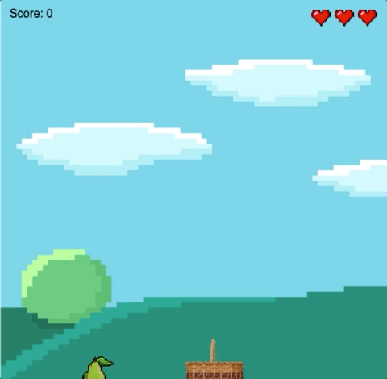

# Collection Style Game 
This is a Collection Style Game Project. Where you can move the cursor as a basket to collect the failling different 
falling fruits. It will collect points. If you miss the fruits many times, you can lose. 
# Game Overview

#### [----> Click me to play the game!](https://replit.com/@AmyBian/Cloudy-with-a-Chance-of-Fruit)

### Project 
- Include a falling object sprite that falls from random positions during the game. 
- Include a catcher sprite that moves left and right when the arrow keys are pressed. 
- Detect collision when the falling object collides with the catcher.
- Include a score variable.
- Increase the score when the falling object collides with the catcher.
- Adding many falling object
- Adding a home screen 

### ← assets

Drag in assets, like images, to add them to your project. If you are adding an image, it is best to save it to your computer, then upload the file to the `assets` folder. The url of the image will be `assets/example.jpg` or `assets/example.png`.

### ← index.html

The HTML file contains HTML code that sets up a webpage for our game. We also add libraries in this file using HTML tags.

### ← style.css

The CSS file adds styling rules to your content like changing colors and fonts. We will not use this file for our game and instead update the style of our game in the script.js file.  

